# AWS Cloud Security Consulting Project: IAM Access Control for a Fitness App Startup

**Role:** Cloud Engineer Consultant (portfolio project)
**Client (fictional):** StartupCo - early-stage fitness tracking app, 10 employees, 3 months on AWS

---

## 1. Problem Statement

StartupCo launched quickly and, like many early-stage startups, deferred security fundamentals to hit their launch date. By the time this engagement started, the situation was:

- All 10 employees shared root account credentials
- No separation of permissions between Developers, Operations, Finance, and Data Analysts
- No MFA, no password policy
- Root credentials shared via team chat
- Infrastructure: EC2, S3, RDS, CloudWatch, with separate dev/prod environments - all accessed the same way, by everyone

The risk: any single leaked credential (or disgruntled/careless employee) has unrestricted control over production infrastructure and customer fitness data. There is no audit trail distinguishing who did what, and no way to revoke one person's access without rotating credentials for the entire company.

**Goal:** design and implement a least-privilege IAM structure, secure the root user, and document an architecture that reflects both the current infrastructure and security-hardened improvements - without over-engineering for a 10-person company.

---

## 2. Architecture

### 2.1 Infrastructure diagram

Two environments (`VPC-Development`, `VPC-Production`), each with:

- **Public subnet:** Application Load Balancer (ALB), NAT Gateway
- **Private subnet:** EC2 (application server), RDS
- **S3 Gateway Endpoint:** private-subnet resources reach S3 without traversing the NAT Gateway or public internet
- **CloudWatch:** drawn *outside* both VPCs, since it is a regional/account-level service, not a VPC-scoped resource — EC2 and RDS in both environments push logs/metrics to it (dashed connections in the diagram, distinct from solid network-path arrows)

**Traffic flow (inbound):**
```
User → Internet Gateway → ALB (public subnet) → EC2 (private subnet)
```
The ALB terminates the user's connection and opens a *new*, separate connection to EC2 over the VPC's internal network. EC2 never has a public IP or a route to the Internet Gateway - its security group only accepts inbound traffic from the ALB's security group, not from `0.0.0.0/0`. This means EC2 is unreachable from the internet under any circumstance, even if its private IP were somehow discovered.

**Traffic flow (outbound, e.g., OS patches/dependencies):**
```
EC2 (private subnet) → NAT Gateway (public subnet) → Internet Gateway → internet
```

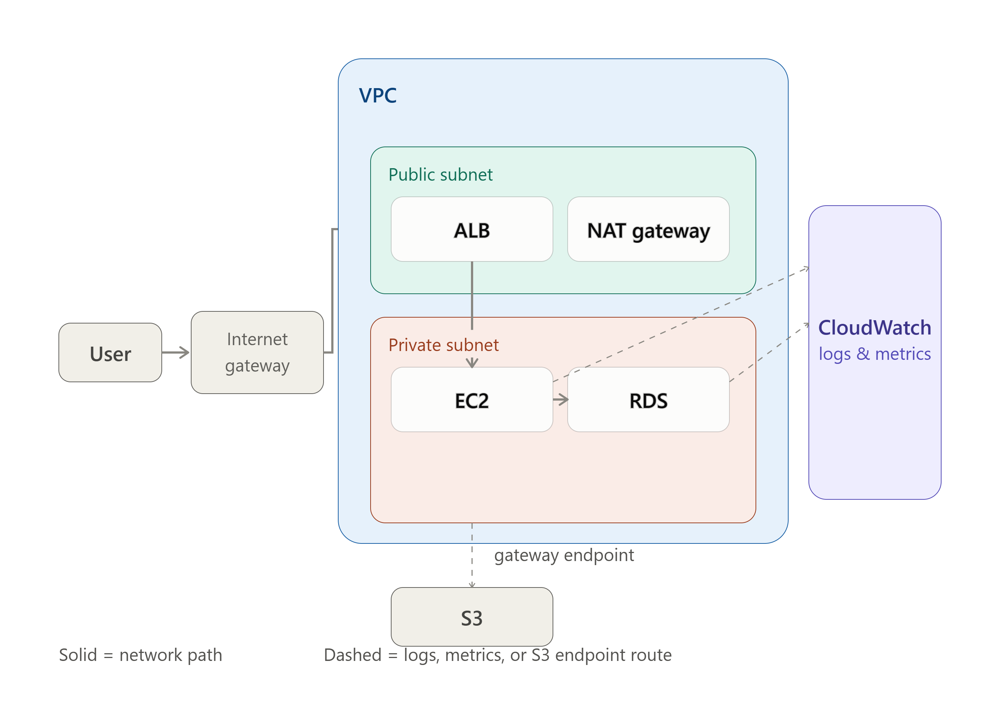

### 2.2 Dev/Prod separation — decision and trade-offs

The brief specifies "several development and production environments" without prescribing an isolation strategy. Three options were evaluated:

| Option | Isolation strength | Complexity | Cost |
|---|---|---|---|
| Separate AWS accounts | Strongest — enforced by AWS itself | Highest (cross-account roles needed for any legitimate cross-env access) | Higher ops overhead |
| Separate VPCs, same account, tag-based IAM conditions | Network-isolated; IAM isolation depends on consistent tagging | Moderate | Two NAT Gateways + two ALBs running continuously |
| Same VPC, naming convention only | Weakest — no structural enforcement | Lowest | Lowest |

**Decision:** Separate VPCs within a single account, with IAM policy conditions on the `environment` resource tag (e.g., `aws:ResourceTag/environment = dev`). This gives real network isolation and a genuine (if tag-dependent) IAM boundary, appropriate for a 10-person company, without the operational overhead of full multi-account management.

**Documented limitation:** the condition checks whether a resource is *already* tagged `dev` - so a brand-new, untagged EC2 instance fails that check by default. This creates a deadlock: a Developer can't tag a new instance to bring it into scope either, since tagging (`ec2:CreateTags`) is itself governed by the same `aws:ResourceTag` condition, and nothing exists yet for it to match against. As tested and demonstrated (see §4.2 below), the policy governs managing resources an admin has already tagged; self-service instance creation for Developers is scoped out of the tested baseline and covered as an enhancement here.

**Enhanced version — Developer self-service instance creation.** The fix uses `aws:RequestTag` instead of `aws:ResourceTag`, checking the tag being *applied at creation time* rather than one that already exists — this breaks the deadlock. Three additional statements are needed beyond the baseline policy:

```json
{
  "Sid": "AllowInstanceCreationAsDev",
  "Effect": "Allow",
  "Action": ["ec2:RunInstances"],
  "Resource": "arn:aws:ec2:*:*:instance/*",
  "Condition": {
    "StringEquals": { "aws:RequestTag/environment": "dev" }
  }
},
{
  "Sid": "AllowRunInstancesSupportingResources",
  "Effect": "Allow",
  "Action": ["ec2:RunInstances"],
  "Resource": [
    "arn:aws:ec2:*:*:network-interface/*",
    "arn:aws:ec2:*:*:subnet/*",
    "arn:aws:ec2:*:*:security-group/*",
    "arn:aws:ec2:*::image/*",
    "arn:aws:ec2:*:*:volume/*",
    "arn:aws:ec2:*:*:key-pair/*"
  ]
},
{
  "Sid": "AllowTaggingAsDevOnly",
  "Effect": "Allow",
  "Action": "ec2:CreateTags",
  "Resource": "*",
  "Condition": {
    "StringEquals": {
      "aws:RequestTag/environment": "dev",
      "ec2:CreateAction": "RunInstances"
    }
  }
}
```

Why each exists:
- `AllowInstanceCreationAsDev` - permits launching a new instance, but only if it's tagged `environment=dev` as part of the same launch request. Launching untagged, or tagged `prod`, isn't covered.
- `AllowRunInstancesSupportingResources` - `RunInstances` also checks permissions on the network interface, subnet, security group, AMI, volume, and key pair it references; these aren't environment-restricted since they're supporting resources, not the instance itself.
- `AllowTaggingAsDevOnly` - separately allows `CreateTags`, scoped both to the `dev` tag value and, via `ec2:CreateAction`, to tags applied specifically during a `RunInstances` call - preventing this permission from being used to retag unrelated existing resources.

Known remaining gap: a Developer still can't retag an existing untagged resource created by someone else outside of a `RunInstances` call - narrower and less common in practice, not addressed here.

**Recommendation to the client:** as the company scales past ~20-30 employees or handles more sensitive data volume, migrate to separate AWS accounts (via AWS Organizations) for stronger isolation.

**Cost trade-off noted:** running two NAT Gateways and two ALBs continuously has an ongoing hourly cost. For a startup this size, scaling down or removing the dev NAT Gateway outside working hours is a reasonable cost-control measure.

### 2.3 Access/permission model diagram

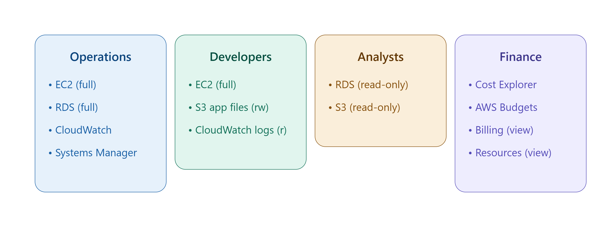

Groups map directly to the brief's team structure, plus one additional group for administrative access:

- `Developers` (4 users)
- `Operations` (2 users)
- `Finance` (1 user)
- `Analysts` (3 users)
- `Administrators` (break-glass/setup access, MFA-enforced, used sparingly)

---

## 3. Securing the Root User

Root user and root account are the same identity in AWS - a client-side terminology note clarified early in the project (the brief said "root account," which is informally used interchangeably with "root user").

Actions taken:

1. **MFA enabled** on the root user via virtual MFA app (free, no hardware dependency for a small team)


3. **Root access keys checked and confirmed absent** (or deleted, if present) - root should never have programmatic access keys, since they bypass MFA for API calls
4. **Root password rotated** (previous one was compromised by being shared in team chat) and stored in a password manager, access restricted to 1–2 people (CTO + one Ops lead)
5. **Root reserved for account-level actions only** (closing the account, changing support plan, certain billing/tax settings) - every day-to-day action now goes through the role-based IAM structure below
6. **Root login detection/alerting configured** (detective control, complementing the preventive controls above):

```
Root login event
    → CloudTrail (management-event-trail, multi-region, records login)
    → CloudWatch Logs (aws-cloudtrail-logs-<account-id>-<suffix> log group)
    → CloudWatch Metric Filter (RootLoginFilter, namespace RootLoginMonitoring)
    → CloudWatch Alarm ("login as root", triggers if RootLoginCount ≥ 1)
    → SNS Topic (Default_CloudWatch_Alarms_Topic) → email notification
```
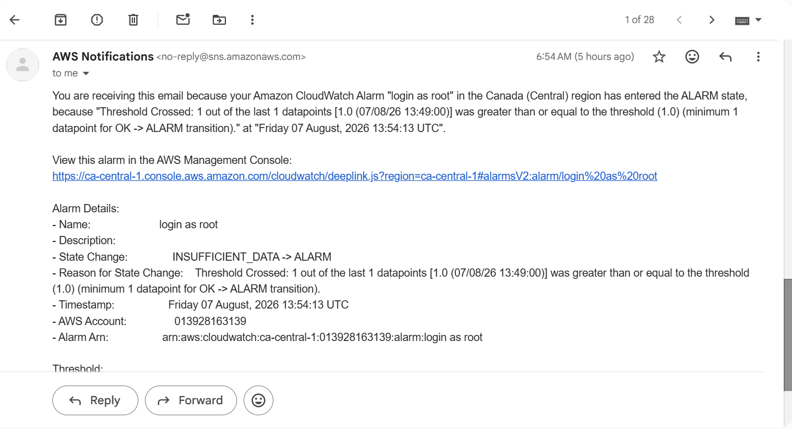
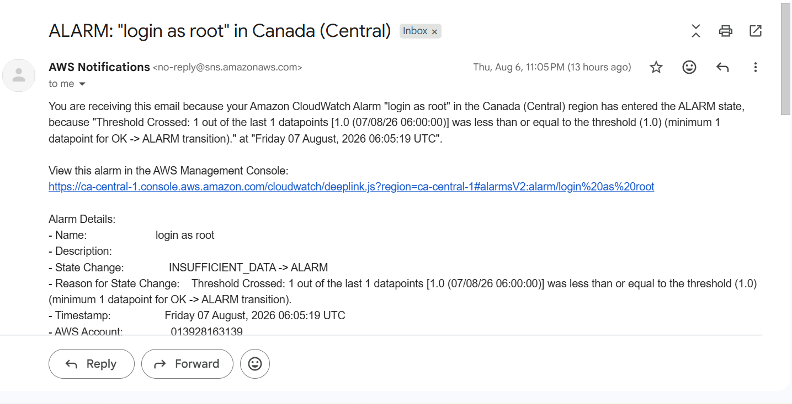
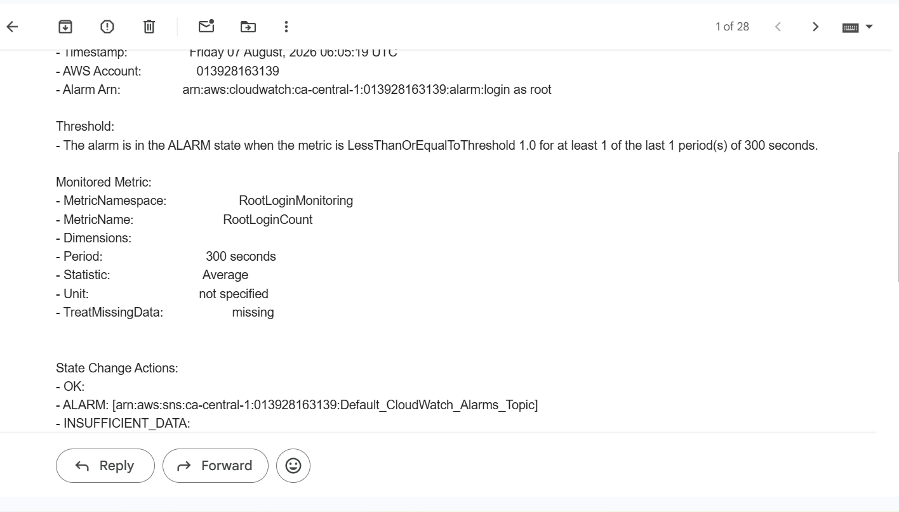

CloudTrail is a mandatory-S3, optional-CloudWatch-Logs service: every trail must write to an S3 bucket (durable, long-term archive), and can optionally also stream the same events to CloudWatch Logs in near-real-time so they can be actively monitored. Encryption was left at default S3-managed (SSE-S3) rather than a customer-managed KMS key — the added cost and key-management overhead of KMS wasn't proportionate for this account's low event volume, and SSE-S3 already covers data-at-rest protection. This tradeoff, not a maximalist "enable everything" default, is the kind of decision worth being able to explain.

Metric filter pattern used:
```
{ $.userIdentity.type = "Root" && $.eventType != "AwsServiceEvent" }
```

**Verified working, not just configured.** Getting this pipeline to actually fire took several rounds of debugging, worth documenting since the failure modes are non-obvious:
- Initially tried the console's "Create composite alarm" flow instead of a plain metric alarm - composite alarms use a different field (`alarmRule`) and rejected an empty rule with a validation error unrelated to the real issue.
  
  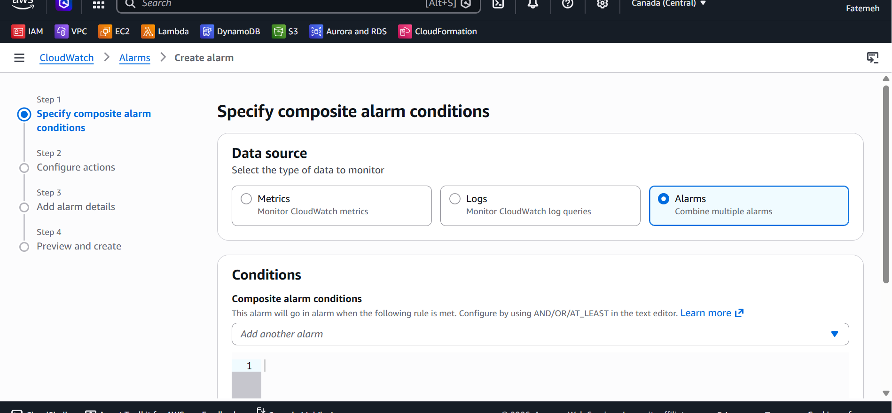
  
- The metric didn't appear in the alarm's "Select metric" browser at first - CloudWatch only lists metrics that have already emitted at least one data point, and no root login had occurred yet since the trail was created, so there was nothing to browse for. Creating the alarm directly from the metric filter's row (rather than the general metric browser) sidesteps this.

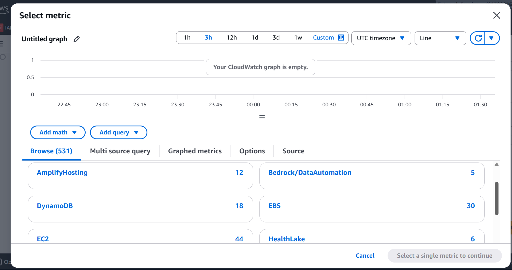
  
- The metric filter's test box needs a **single-line (minified)** JSON log event - pasting the pretty-printed, multi-line version caused CloudWatch to treat every line as a separate malformed "event," none of which could match.

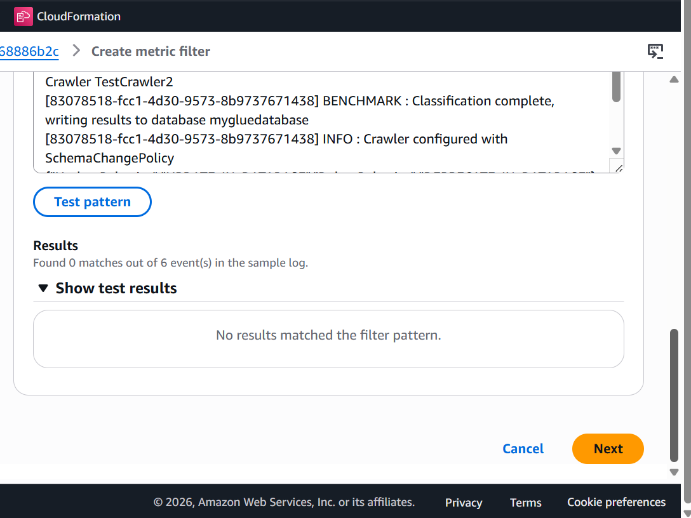
  
- The alarm's threshold condition was initially set to **Lower/Equal (≤ 1)** instead of **Greater/Equal (≥ 1)** - an easy radio-button mixup that put the alarm in a permanent false "ALARM" state, since a count of 0 is always ≤ 1.

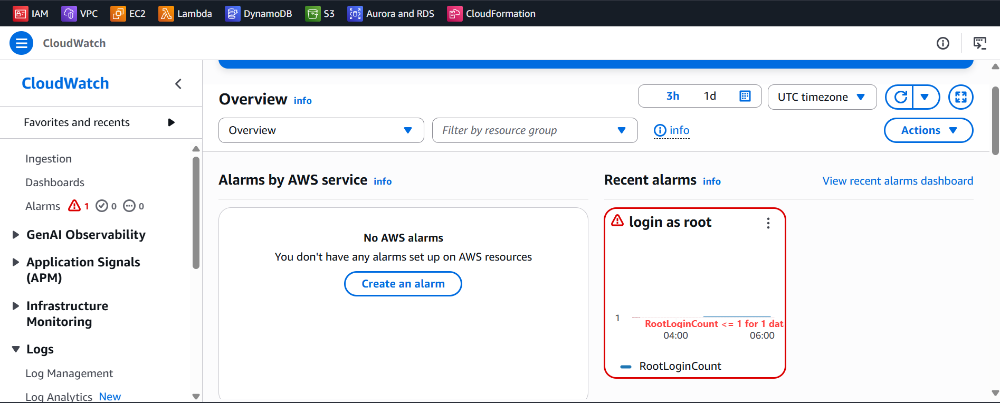

Once corrected, the alarm history confirms two independent successful cycles - real root logins on 2026-08-07 correctly transitioned the alarm `Insufficient data → In alarm`, with the SNS notification action executing successfully both times, then settling back to `Insufficient data` once the triggering data point aged out of the evaluation window (expected, since the metric only publishes a data point when a match occurs, not a continuous "0" baseline).

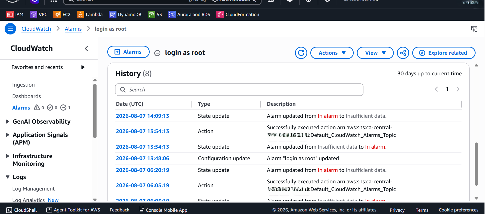


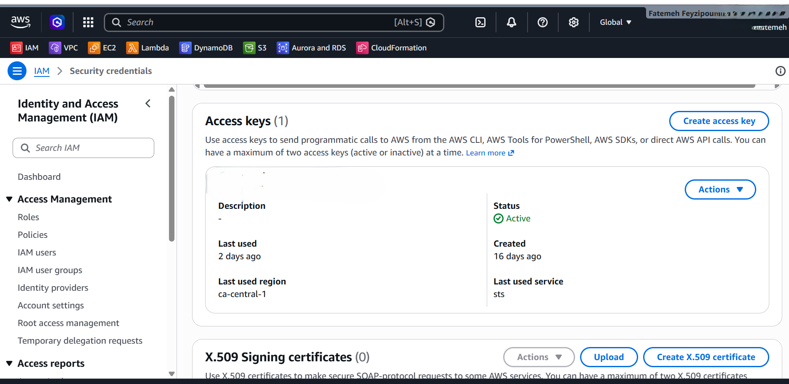

---

## 4. IAM Users, Groups, and Permissions

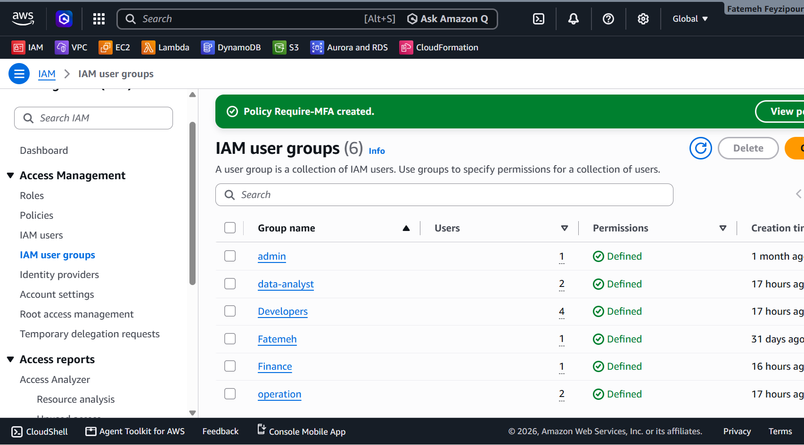

### 4.1 Administrators group

An IAM user with `AdministratorAccess` was created to replace day-to-day root usage during setup and ongoing administration. This account is MFA-enforced and reserved for IAM/security configuration tasks - not routine daily work, which is handled through the role-based groups below.

### 4.2 Developers

| Requirement (brief) | Implementation |
|---|---|
| EC2 management | `AmazonEC2FullAccess` |
| S3 access for application files | Custom inline policy, scoped to the specific app-files bucket (both bucket and object ARNs), with read/write/delete - developers deploy files themselves in this setup |
| CloudWatch logs viewing | Custom inline policy: `logs:GetLogEvents`, `logs:DescribeLogGroups`, `logs:DescribeLogStreams`, `logs:FilterLogEvents` (no write/delete) |

**Why custom policies for S3 and Logs instead of AWS managed policies:** `AmazonS3ReadOnlyAccess` (the closest managed policy) grants access to *every* bucket in the account, including the bucket storing user data - not just application files. Scoping to a named bucket ARN enforces the boundary the brief implies but doesn't state explicitly.

**Why EC2 stayed as the broad managed policy:** the brief doesn't request per-environment restriction for Developers' EC2 access explicitly; a tag-conditioned version (limiting full access to `environment=dev` resources, read-only in `prod`) was designed and is documented as a planned enhancement (see §2.2 and Level 2 roadmap).

### 4.3 Operations

| Requirement (brief) | Implementation |
|---|---|
| Full EC2 access | `AmazonEC2FullAccess` |
| Full CloudWatch access | `CloudWatchFullAccess` |
| Systems Manager access | `AmazonSSMFullAccess` |
| RDS management | `AmazonRDSFullAccess` |

**Note:** CloudWatch (`cloudwatch:*`) and CloudWatch Logs (`logs:*`) are distinct AWS action namespaces despite both falling under the "CloudWatch" product umbrella. An early draft of this policy mistakenly attached `CloudWatchEventsFullAccess` (a third, unrelated namespace for EventBridge-style scheduled rules) - caught and corrected during review. Worth verifying `CloudWatchFullAccess` includes `logs:*` actions if Operations needs full log management, not just metrics/alarms/dashboards.

### 4.4 Finance

| Requirement (brief) | Implementation |
|---|---|
| Cost Explorer | Custom inline policy: `ce:GetCostAndUsage`, `ce:GetCostForecast`, `ce:GetDimensionValues`, `ce:GetTags` |
| AWS Budgets | `AWSBudgetsReadOnlyAccess` |
| Read-only resource access | `ViewOnlyAccess` |
| (Supporting) Billing visibility | `AWSBillingReadOnlyAccess` + `Billing` |

**Note:** Billing, Cost Explorer, and Budgets are three distinct permission surfaces in AWS, despite reading as one concept ("cost management") in the brief's summary. Each required its own policy.

**Open decision documented:** `AWSBudgetsReadOnlyAccess` allows viewing budgets but not creating/editing them. If the Finance Manager needs to create new budget alerts independently (rather than have them pre-configured), `AWSBudgetsActionsWithAWSResourceControlAccess` should be substituted.

### 4.5 Analysts

| Requirement (brief) | Implementation |
|---|---|
| Read-only S3 | `AmazonS3ReadOnlyAccess` (or custom bucket-scoped equivalent — see note) |
| Read-only database access | `AmazonRDSReadOnlyAccess` |

**Important distinction documented:** IAM-level RDS read-only access controls the RDS *API/metadata* (viewing instance configuration, status, snapshots) - it does **not** grant read access to rows/tables inside the database. That requires a separate database-level read-only credential (e.g., a Postgres/MySQL user with `SELECT`-only grants), which is outside IAM's scope and would need to be provisioned separately if Analysts need to query actual application data.

### 4.6 Account-wide security settings

**Password policy:**
- Minimum length: 14 characters
- Requires uppercase, lowercase, number, and symbol
- Expiration: 90 days
- Password reuse prevention: last 5 passwords
- Users may change their own password
  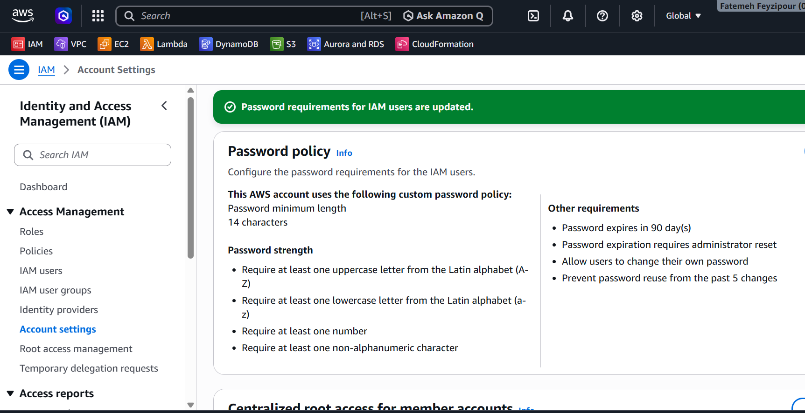

**MFA enforcement:** a standalone customer-managed policy (`Require-MFA`) attached to all five groups. It allows any authenticated user to manage their own MFA device, but denies nearly all other actions unless `aws:MultiFactorAuthPresent` is true. This converts "users should have MFA" from a policy expectation into a technically enforced requirement — a user without MFA configured can do nothing except set it up.

---

## 5. Key Learnings

- **The brief's summary section and detailed implementation section are not redundant** - the detailed section is the authoritative source, and several requirements (CloudWatch for Developers, RDS read-only for Analysts, the specific service list for Operations' "full access") only appear there.
- **CloudWatch is not one thing.** Core CloudWatch (`cloudwatch:*`), CloudWatch Logs (`logs:*`), and CloudWatch Events/EventBridge (`events:*`) are separate permission namespaces that are easy to conflate when browsing the managed policy list.
- **IAM read-only ≠ database read-only.** IAM controls the AWS API surface; it has no visibility into what's inside a database or an S3 object. This distinction matters when a "read-only" requirement in a brief could mean either.
- **AWS managed policies are broad by design.** They're a good starting point but often don't respect resource-level boundaries a business actually needs (e.g., one bucket vs. all buckets). Custom inline policies with explicit ARNs are the difference between "access to the service" and "access to *this* resource."
- **Tag-based conditional access is powerful but fragile** - it depends entirely on consistent resource tagging, which is a process/discipline problem as much as a technical one.
- **CloudWatch metrics are lazy, not eager.** A metric doesn't exist as a browsable entity until it's actually emitted a data point at least once - configuring a metric filter isn't enough on its own; something has to trigger a real match first, or the alarm-creation flow will show an empty metric list with no indication why.
- **Alarm threshold direction is worth double-checking, not assuming.** A single flipped radio button (Lower/Equal vs. Greater/Equal) silently produces a permanently-triggered alarm rather than an error - worth verifying the alarm's own state description (e.g., "RootLoginCount <= 1 for 1 datapoint") matches the intended logic before trusting it.

---

## 6. Deliverables Checklist

- [x] Architecture diagram (infrastructure)
- [x] Architecture diagram (access/permission model)
- [x] Root user secured (MFA, credential rotation, key removal, login alerting)
- [x] IAM groups and users created
- [x] Least-privilege policies implemented per group
- [x] Account-wide MFA enforcement and password policy
- [x] Documentation (this file)
- [x] Infrastructure as Code - Terraform / CloudFormation / CDK (see `LEVEL2-IAC-ROADMAP.md`)

---

*This project was built as a hands-on portfolio exercise for a fictional client scenario, to practice AWS IAM design, least-privilege policy authorship, and cloud security fundamentals.*